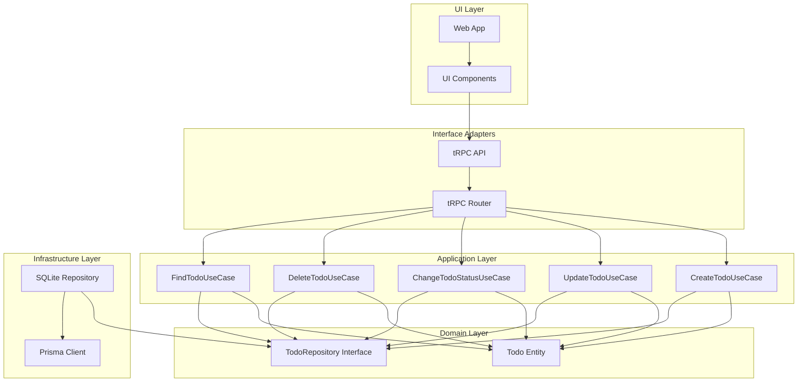
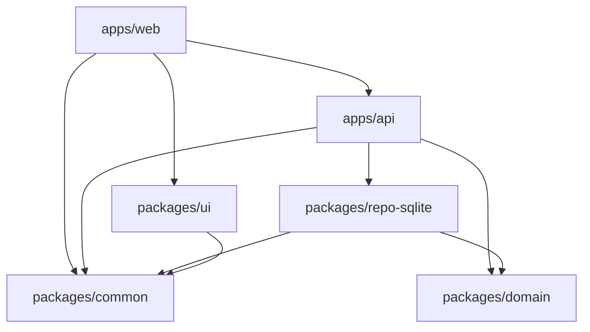
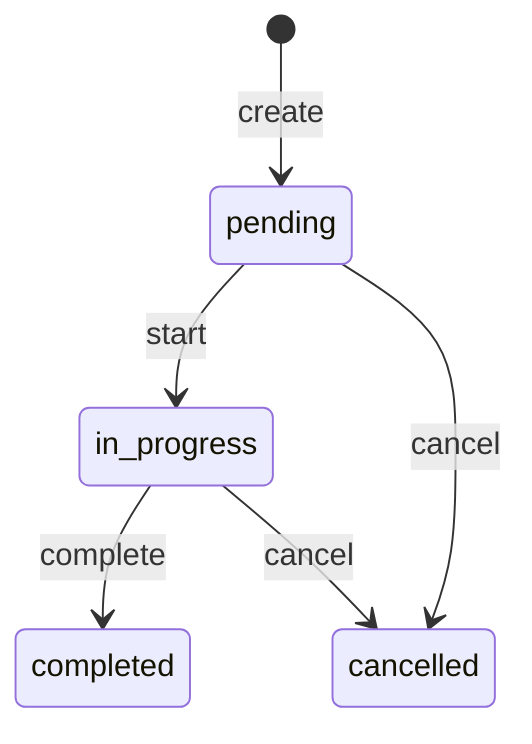
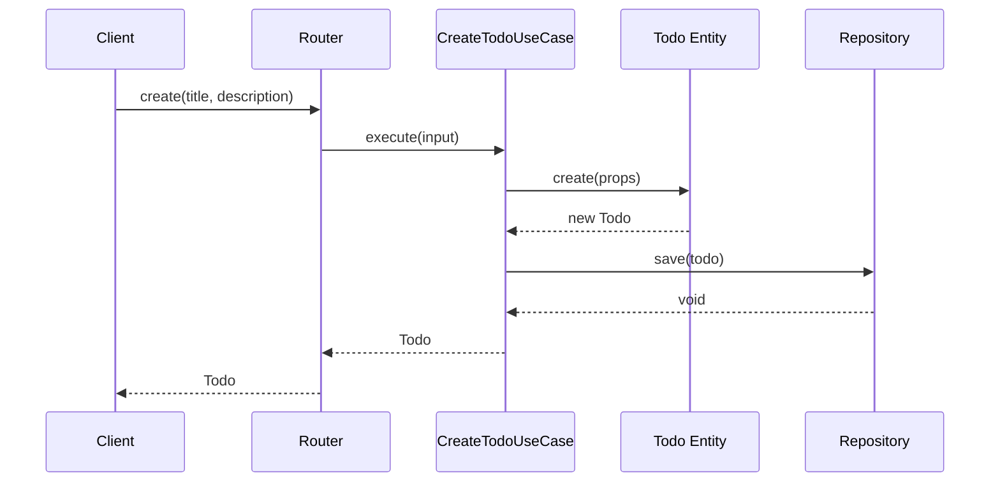
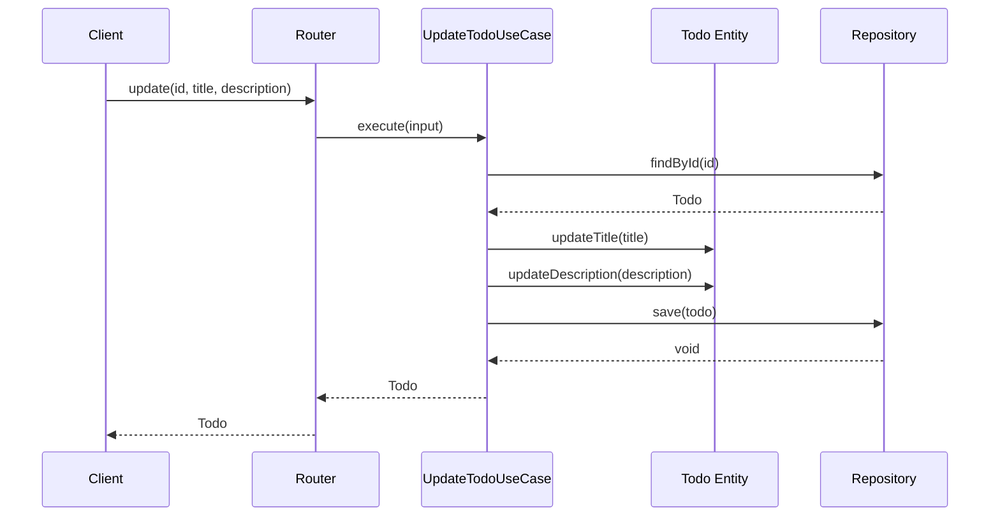
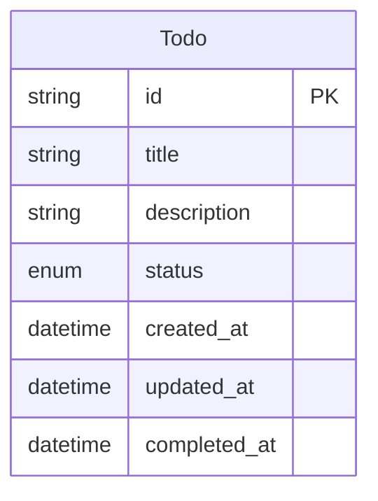
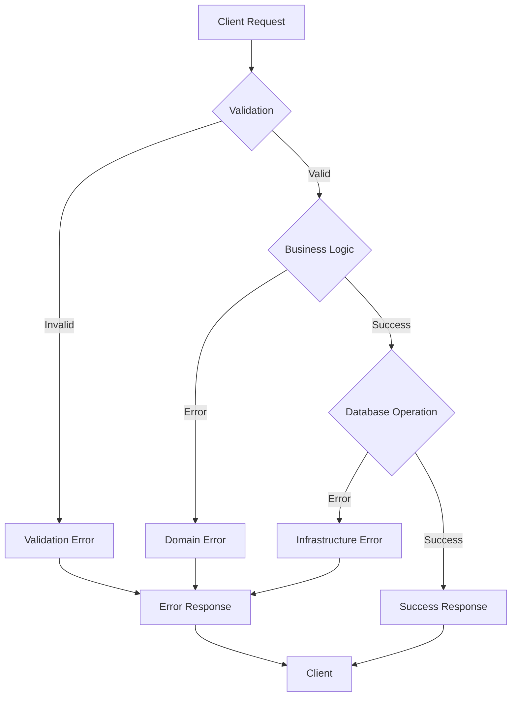
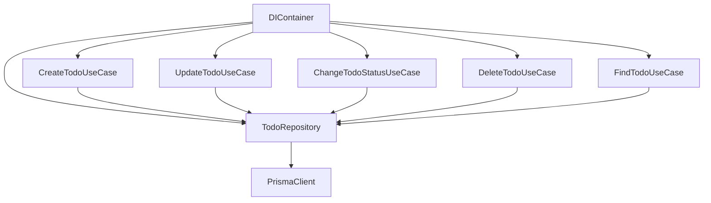

# アーキテクチャ図解

## レイヤー構造

```mermaid
graph TD
    subgraph "UI Layer"
        Web[Web App]
        Components[UI Components]
    end

    subgraph "Interface Adapters"
        API[tRPC API]
        Router[tRPC Router]
    end

    subgraph "Application Layer"
        UC1[CreateTodoUseCase]
        UC2[UpdateTodoUseCase]
        UC3[ChangeTodoStatusUseCase]
        UC4[DeleteTodoUseCase]
        UC5[FindTodoUseCase]
    end

    subgraph "Domain Layer"
        Todo[Todo Entity]
        TodoRepo[TodoRepository Interface]
    end

    subgraph "Infrastructure Layer"
        SQLite[SQLite Repository]
        Prisma[Prisma Client]
    end

    Web --> Components
    Components --> API
    API --> Router
    Router --> UC1 & UC2 & UC3 & UC4 & UC5
    UC1 & UC2 & UC3 & UC4 & UC5 --> Todo
    UC1 & UC2 & UC3 & UC4 & UC5 --> TodoRepo
    SQLite --> TodoRepo
    SQLite --> Prisma
```

## パッケージ依存関係

```mermaid
graph TD
    Web[apps/web] --> UI[packages/ui]
    Web --> Common[packages/common]
    Web --> API[apps/api]
    
    API --> Domain[packages/domain]
    API --> RepoSQLite[packages/repo-sqlite]
    API --> Common
    
    RepoSQLite --> Domain
    RepoSQLite --> Common
    
    UI --> Common
```

## Todoの状態遷移

```mermaid
stateDiagram-v2
    [*] --> pending: create
    pending --> in_progress: start
    in_progress --> completed: complete
    pending --> cancelled: cancel
    in_progress --> cancelled: cancel
```

## ユースケースシーケンス

### Todo作成

```mermaid
sequenceDiagram
    participant C as Client
    participant R as Router
    participant U as CreateTodoUseCase
    participant E as Todo Entity
    participant DB as Repository

    C->>R: create(title, description)
    R->>U: execute(input)
    U->>E: create(props)
    E-->>U: new Todo
    U->>DB: save(todo)
    DB-->>U: void
    U-->>R: Todo
    R-->>C: Todo
```

### Todo更新

```mermaid
sequenceDiagram
    participant C as Client
    participant R as Router
    participant U as UpdateTodoUseCase
    participant E as Todo Entity
    participant DB as Repository

    C->>R: update(id, title, description)
    R->>U: execute(input)
    U->>DB: findById(id)
    DB-->>U: Todo
    U->>E: updateTitle(title)
    U->>E: updateDescription(description)
    U->>DB: save(todo)
    DB-->>U: void
    U-->>R: Todo
    R-->>C: Todo
```

## データベーススキーマ

```mermaid
erDiagram
    Todo {
        string id PK
        string title
        string description
        enum status
        datetime created_at
        datetime updated_at
        datetime completed_at
    }
```

## エラーハンドリングフロー

```mermaid
graph TD
    A[Client Request] --> B{Validation}
    B -->|Invalid| C[Validation Error]
    B -->|Valid| D{Business Logic}
    D -->|Error| E[Domain Error]
    D -->|Success| F{Database Operation}
    F -->|Error| G[Infrastructure Error]
    F -->|Success| H[Success Response]
    
    C --> Z[Error Response]
    E --> Z
    G --> Z
    H --> Y[Client]
    Z --> Y
```

## DIコンテナの構造

```mermaid
graph TD
    Container[DIContainer] --> TodoRepo[TodoRepository]
    TodoRepo --> Prisma[PrismaClient]
    Container --> UC1[CreateTodoUseCase]
    Container --> UC2[UpdateTodoUseCase]
    Container --> UC3[ChangeTodoStatusUseCase]
    Container --> UC4[DeleteTodoUseCase]
    Container --> UC5[FindTodoUseCase]
    UC1 & UC2 & UC3 & UC4 & UC5 --> TodoRepo
``` 